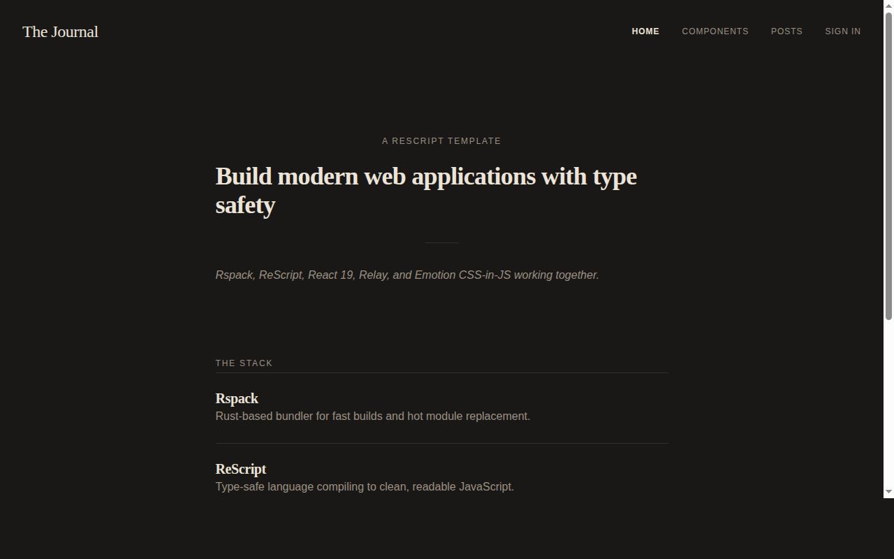
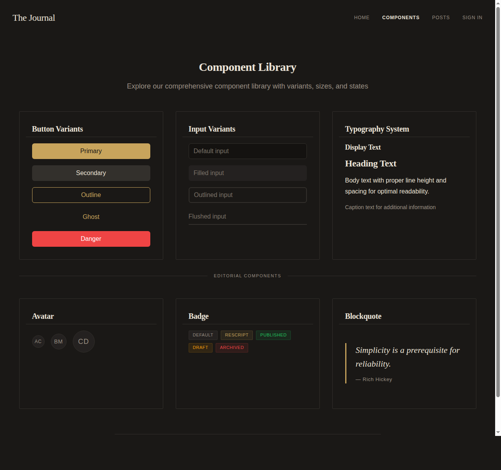
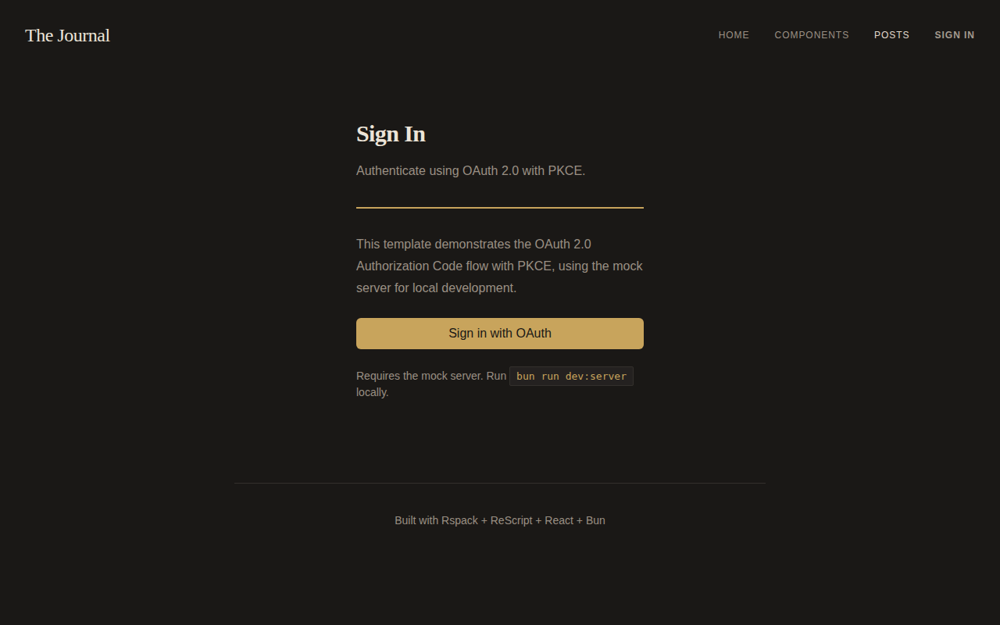

# Rspack + ReScript Template

A production-ready template for building modern web applications with ReScript, Rspack, React 19, Relay, and Emotion CSS-in-JS. Editorial design with Playfair Display serif typography.



## Stack

| Layer | Technology |
|-------|-----------|
| Language | ReScript 12.2 |
| UI | React 19.2 |
| Bundler | Rspack 1.7 |
| Styling | Emotion CSS-in-JS |
| Data | Relay (rescript-relay) + GraphQL |
| Auth | OAuth 2.0 PKCE |
| Testing | Vitest + React Testing Library |

## Pages

| Route | Description |
|-------|-------------|
| `/` | Editorial homepage with stack overview |
| `/components` | Component library showcase |
| `/posts` | Blog posts fetched via Relay (protected, requires auth) |
| `/login` | OAuth 2.0 PKCE sign-in |



## Getting started

### Prerequisites

- [Bun](https://bun.sh) installed locally

```bash
curl -fsSL https://bun.sh/install | bash
```

### Install and run

```bash
bun install
bun run dev
```

This starts three processes concurrently:

- **ReScript** watcher (compiles `.res` to `.bs.js`)
- **Rspack** dev server at `http://localhost:8080`
- **Mock GraphQL server** at `http://localhost:4000/graphql`

### Scripts

| Script | Description |
|--------|-------------|
| `bun run dev` | Start all dev services |
| `bun run dev:server` | Start mock GraphQL/OAuth server only |
| `bun run build` | Production build |
| `bun run res:build` | Compile ReScript |
| `bun run res:dev` | ReScript watch mode |
| `bun run res:clean` | Clean ReScript build |
| `bun run relay` | Run Relay compiler |
| `bun run test` | Run tests |
| `bun run test:watch` | Run tests in watch mode |
| `bun run lint` | Lint with Biome |
| `bun run format:write` | Format with Biome |
| `bun run commit` | Create conventional commit |

## Architecture

### ReScript compilation flow

1. `.res` files compile to `.bs.js` ES modules (in-source)
2. Rspack bundles the `.bs.js` files with React Fast Refresh
3. `.bs.js` files are gitignored build artifacts

### Project structure

```
src/
  pages/            # Route pages (Home, Components, Posts, Login)
  components/       # UI components (Button, Card, Input, Typography, ...)
  styles/           # Design system (Theme, GlobalStyles, Layout)
  bindings/         # JS library bindings (Emotion, OAuthPkce)
  context/          # React contexts (AuthContext)
  relay/            # Relay environment
  __tests__/        # Vitest test suites
  __generated__/    # Relay compiler output
mock-server/        # GraphQL + OAuth mock server
```

### Design system

Tokens are centralized in `src/styles/Theme.res`. Components reference tokens via `Emotion.Utils.Color` rather than hardcoded values. Changing a color in Theme.res propagates everywhere.

### Authentication

OAuth 2.0 Authorization Code + PKCE flow:

1. User clicks "Sign in with OAuth" on `/login`
2. Browser redirects to mock server's `/oauth/authorize`
3. Mock server auto-approves, redirects to `/callback?code=...&state=...`
4. `CallbackPage` validates state, exchanges code for token
5. User is authenticated and can access `/posts`



### Data fetching

Posts are fetched via Relay using a `%relay` query that compiles at build time. The mock GraphQL server provides User and Post types with in-memory data.

```rescript
module PostsQuery = %relay(`
  query PostsPageQuery {
    posts {
      id
      title
      body
      author { name }
    }
  }
`)
```

## Component library

- **Button** &mdash; 5 variants, 5 sizes, loading state, icon support
- **Input** &mdash; 4 variants, 3 sizes, 4 validation states
- **Card** &mdash; 3 variants with Header/Body/Footer
- **Typography** &mdash; Display, Heading, Body, Caption, Overline
- **Avatar** &mdash; Initials fallback, 3 sizes
- **Badge** &mdash; 5 semantic variants
- **Blockquote** &mdash; Serif italic with attribution
- **Divider** &mdash; Horizontal rule with optional label

## Code quality

- **Biome** for linting and formatting
- **Husky** pre-commit hooks (format + lint)
- **Commitizen** with commitlint for conventional commits
- **Vitest** with React Testing Library (18 tests)

## Deployment

Deployed via [Vercel](https://vercel.com). The Posts and Login pages require the mock server running locally.

## License

[MIT](LICENSE)
